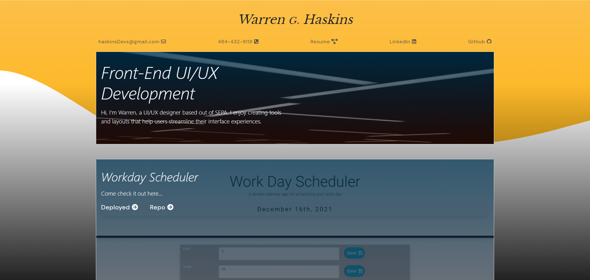

# Portfolio-Update

-https://github.com/warrenhaskins1/Portfolio-Update
-

# Description

- This is an updated version of the initial portfolio submission for UPenn's LPS Full-Stack Coding Bootcamp.

## Installation
- The only required equipment neccessary to view is a web-browser and internet connection.

## License

-